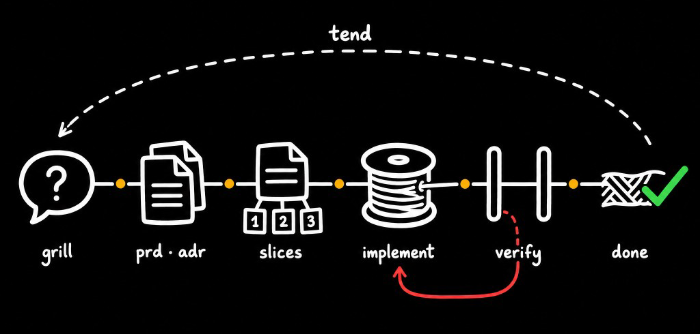
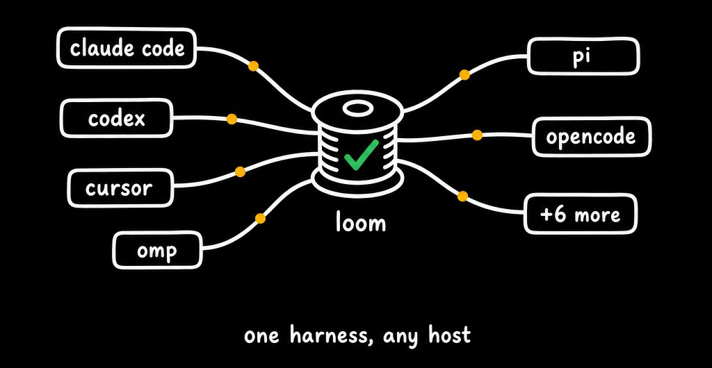

<p align="center">
  
</p>

# Loom

[](https://github.com/zuevrs/loom/actions/workflows/checks.yml) [](LICENSE)

A skills-first harness that makes coding agents work like disciplined senior developers — across hosts.

The lazy kind of senior. The one who deletes your fifty lines, ships one, and never — ever — marks a ticket done without a review. Loom installs him into Claude Code, Codex, Cursor, OMP, and friends: a discipline ladder, six ritual skills, lifecycle hooks, and a hard verify-before-done gate.

## Sixty seconds of Loom

Your agent finishes a feature and marks the issue done. Nobody reviewed anything. On a Loom host, the turn doesn't end:

```
$ .loom/auth/issues/01-jwt.md → Status: done      (## Verify section: empty)
$ agent tries to stop
⛔ BLOCKED: 01-jwt.md marked done without an APPROVE verify digest.
   Run loom-verify — or, if the done status itself is wrong, set the issue
   back to ready-for-agent / needs-triage / wontfix. Do not fabricate an APPROVE.
```

So the agent runs `loom-verify`: two fresh-context checker sub-agents (Spec and Standards, on the host's cheap tier) read the diff and write their verdict into the issue file:

```
APPROVE — 2026-07-05 — spec pass, standards pass
```

Now `done` means reviewed-and-done. That loop — plan in issues, implement one slice, verify before done — is the whole product:

<p align="center">
  
</p>

**Loom is:** a markdown-native harness — discipline ladder, six rituals, verify-before-done, and host-native enforcement hooks that leverage each agent's own capabilities.

**Loom is not:** a runtime engine, an auto-merge bot, a replacement for your issue tracker, or a hosted agent service. Cold agents guess intent, over-engineer, skip verification, and lose context between sessions; Loom closes these gaps with on-disk conventions — no lock-in.

Terms live in [`docs/glossary.md`](docs/glossary.md); per-host depth in [`docs/hosts.md`](docs/hosts.md).

## Install

<p align="center">
  
</p>

Script-based hosts need a clone first (`git clone https://github.com/zuevrs/loom ~/.loom`); the installer is pure Node, no bash required. Plugin-native hosts need nothing.

**Status legend** (kept honest, see [`docs/evidence/HOST-INSTALL.md`](docs/evidence/HOST-INSTALL.md)): **verified** = exercised in live sessions or CI; *implemented* = built against the host's official plugin/skill docs, not yet verified end-to-end — reports welcome.

| Host | Install | Uninstall | Status |
|------|---------|-----------|--------|
| Claude Code | `claude plugin marketplace add zuevrs/loom && claude plugin install loom@loom` — rituals are plugin-namespaced: `/loom:loom-init` | `/remove-plugin loom` | **verified** (live full cycle: init → implement → checkers → stop gate) |
| Codex | `codex plugin marketplace add zuevrs/loom && codex plugin add loom@loom` | `codex plugin remove loom@loom && codex plugin marketplace remove loom` | **verified** (install/discovery/uninstall; live model run blocked upstream — Codex ≥0.142 speaks only the Responses API, which z.ai does not serve) |
| OMP (Oh My Pi) | `omp plugin install git:github.com/zuevrs/loom` | `omp plugin uninstall loom` | **verified** (live sessions) |
| Cursor | `node ~/.loom/scripts/install.mjs --cursor` (skills + hooks) | `node ~/.loom/scripts/install.mjs --uninstall --cursor` | **verified** (live sessions) |
| Pi | `pi install git:github.com/zuevrs/loom` | `pi uninstall git:github.com/zuevrs/loom` | **verified** (live smoke: managed block + skills visible, clean uninstall) |
| OpenCode | `opencode plugin -g github:zuevrs/loom` (`-g` = global; without it the plugin lands in the current project's `.opencode/`) | remove `"github:zuevrs/loom"` from `opencode.json` | **verified** (live smoke: managed block + 6 skills in context) |
| Droid (Factory) | `droid plugin install zuevrs/loom` (reads `.claude-plugin/` format) | `droid plugin uninstall loom` | implemented |
| Windsurf | `node ~/.loom/scripts/install.mjs --windsurf` | `node ~/.loom/scripts/install.mjs --uninstall --windsurf` | implemented |
| Kiro | `node ~/.loom/scripts/install.mjs --kiro` | `node ~/.loom/scripts/install.mjs --uninstall --kiro` | implemented |
| Hermes | `ln -s ~/.loom/hermes-plugin ~/.hermes/plugins/loom && hermes plugins enable loom` | `rm -rf ~/.hermes/plugins/loom` | implemented |
| Cline | `~/.loom/scripts/install-agents-skills` (skills only; also reads `AGENTS.md`) | `node ~/.loom/scripts/install.mjs --uninstall --agents` | implemented |
| OpenClaw | `~/.loom/scripts/install-agents-skills`; or `clawhub install zuevrs/loom` | If installed via `clawhub`: remove via the clawhub plugin manager. If installed via `install-agents-skills`: `node ~/.loom/scripts/install.mjs --uninstall --agents` | implemented |

Uninstall removes what Loom owns and leaves foreign files untouched. Project files are yours either way: remove `<!-- loom:begin -->…<!-- loom:end -->` from `AGENTS.md` and delete `.loom/` per project if wanted.

## Quickstart

1. **Install** Loom for your host (above).
2. In your project, invoke **`loom-init`** — confirm the write plan.
3. **`loom-plan`** for multi-session work (or **`loom-implement`** directly for a small fix).
4. **`loom-implement`** one issue at a time; ensure a **`loom-verify`** digest exists before marking done (auto-invoked on some hosts, manual on others).

## Upgrade

1. **Global install** — plugin-native hosts: re-run the install command, then **restart the host process** (a plugin hot-swapped under a running host keeps serving stale code — observed live on OMP; `omp plugin doctor loom` confirms health). Script-based hosts: `git -C ~/.loom pull --ff-only`, then re-run the installer — it repairs its own stale entries and never touches foreign config. If your clone is pinned to a tag (detached HEAD), use `git -C ~/.loom fetch --tags && git -C ~/.loom checkout <new-tag>` instead of pull.
2. **Per project** — run `loom-init` in active repos to refresh the managed block when prompted.
3. **Verify** — `node ~/.loom/scripts/install.mjs --doctor`: checks hook entries point at existing files, skill links aren't broken, **all surfaces resolve into one Loom tree of one version** (hooks from one clone + skills from another upgrade apart silently), and the current project's managed block matches the installed version. Prints the exact fix for anything wrong, changes nothing. Exit 0 = healthy.

A dead hook is silent — the session just runs without enforcement. Run `--doctor` after every upgrade; it exists because a renamed hook file once left the Stop gate dead for two releases before anyone noticed.

## Prerequisites & Troubleshooting

- **Prerequisites:** Git (script-tier clone + upgrades) and Node.js on `PATH` — the only runtime for hooks and installer.
- **Windows:** plugin hosts work out of the box (hooks are plain Node, CI-verified on `windows-latest`); script hosts run `node ~/.loom/scripts/install.mjs --cursor` (or `--windsurf` / `--kiro` / `--agents`) from any shell — skills link as directory junctions, no admin rights needed; where linking is unavailable the installer copies and tells you to re-run after updates.
- **`path exists (skipping)` during install:** a foreign path squats on a loom skill name — move it, re-run.
- **Hooks not taking effect:** confirm entries in host config, restart the host session, then `--doctor`.
- **Managed block version mismatch:** re-run `loom-init` in the affected project.

## Skills

| Skill | Purpose |
|---|---|
| `loom-init` | Project setup: managed block, `.loom/` |
| `loom-plan` | Scope interview → PRD + issue pack |
| `loom-grill` | Freeform brainstorm on any topic (even non-project) → one digest file, no PRD/issues/docs |
| `loom-implement` | Ship one issue with minimal diff |
| `loom-verify` | Fresh checker: Spec + Standards in parallel. Auto-invoked by `loom-implement` — you rarely call it; invoke directly only for ad-hoc review of an arbitrary diff |
| `loom-tend` | Warp maintenance, stale issues, capture learning |

## Hooks & enforcement

Three light lifecycle hooks — non-mutating, no auto-run: **session-start** (context pointers + `.loom` state snapshot with a *next up* resume pointer), **pre-LLM** (invariant guard + anomaly alert, one extra block only when something is wrong), **sub-agent-spawn** (role manifests + verify witness). Hooks inject guidance; they never edit files.

The hard gate: on Stop-hook hosts (Claude Code, Codex, Cursor, Droid) and OMP `session_stop`, an issue at `Status: done` whose `## Verify` section has no APPROVE line **blocks the agent's stop** (exit 2 on the hook contract) with the fix fed back to the model — one forced lap, then it lets go with the warning on record, so headless runs never loop forever. The same script lints `.loom/` state (typo'd statuses, dangling/cyclic blockers — warn-only) and carries the verify-witness warning (an APPROVE with no witnessed checker spawn; `LOOM_WITNESS=strict|off` to tune). Hosts without a stop primitive keep the discipline via the managed block, and the same script runs as a [CI gate](docs/unattended.md#the-verify-gate-as-a-ci-check) to block done-without-APPROVE at PR level.

Checkers default to the host's **fast/cheap tier** — judging is cheaper than making — and your host config always wins.

Per-host wiring, the full feature matrix, checker-model overrides, linter/witness details, and known host limitations: [`docs/hosts.md`](docs/hosts.md).

## Unattended lane

Loom ships no runner — your host already has one (background agents, cron + headless CLI, goal loops). Loom adds the **contract** that keeps an unwatched run safe — dedicated branch, verify before PR, blockers exit as draft PRs, never merge — and a **recipe catalog** for recurring maintenance: [`recipes/`](recipes/) has three discovery recipes that only file `needs-triage` stubs (`docs-drift`, `dep-audit`, `smell-sweep`) and two change recipes that go through the full implement + verify lane (`coverage-raise`, `dead-code`). Wiring: [`docs/unattended.md`](docs/unattended.md).

## Loom + OMP

OMP is the maximum-synergy host: Loom owns **what** to build (PRD, issues, verify contract), OMP owns **how** the agent runs (enforcement, orchestration, review).

```bash
omp plugin install git:github.com/zuevrs/loom
cd your-project && omp        # in session: run loom-init

# Update to latest:
omp plugin install git:github.com/zuevrs/loom --force
```

```
> Plan JWT auth feature                    # → /loom-plan (grill → PRD → issues)
> Implement issue 001-auth-endpoint        # → loom-implement
> Verify                                   # → task: loom-verify-spec + loom-verify-standards
> (agent writes ## Verify, sets Status: done — session_stop gate checks it)
```

Three enforcement layers (TTSR reminder, `session_stop` hard gate, custom verify agents), goal-mode exit guarding for batch runs, and an advisor discipline profile — the full daily workflow and feature table: [`docs/hosts.md`](docs/hosts.md#loom--omp-maximum-synergy).

## Safety

- Hooks are non-mutating — they never edit files; enforcement blocks only at the Stop gate.
- Work needing human judgement (auth, payments, secrets) is routed `ready-for-human` at planning time.
- No auto-merge, no auto-publish, no silent self-rewrite.
- `v0.x` contracts may evolve; follow [`CHANGELOG.md`](CHANGELOG.md) and [`RELEASE.md`](RELEASE.md) for upgrades.

## Contributing

See [`CONTRIBUTING.md`](CONTRIBUTING.md) for local setup, checks, and PR process.

## License

[MIT](LICENSE)
